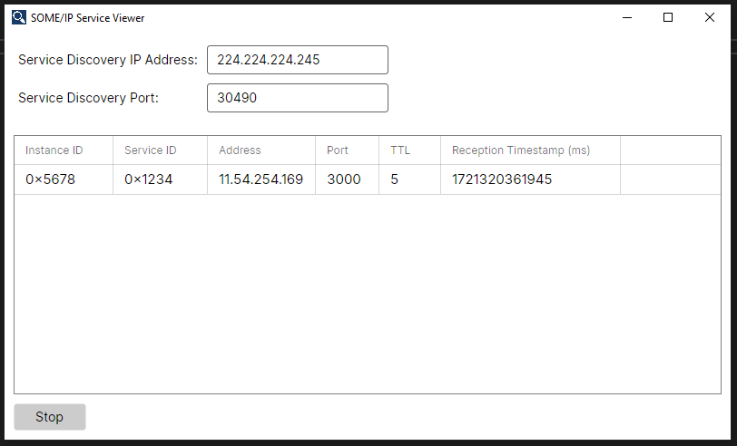

# SOME/IP Service Viewer
A cross-plattform tool for introspection of SOME/IP based systems. The SOME/IP Service Viewer shows all available services in the system to you. You can easily identify which services are up and running and which services may have crashed. The tool runs both on Linux and Windows.

<div align="center">
    
</div>

## Get in Contact :postbox:

If you want to connect, have a feature request, bug report or need support, open an issue on [GitHub](https://github.com/chrizog/someip-service-viewer/issues) or connect on LinkedIn:
> :electric_plug: [LinkedIn](https://www.linkedin.com/in/ch-herzog/)

## Download

A download of the executable will be provided soon and linked here. For now clone the repository and build the solution "ServiceViewer.sln" using Visual Studio. Alternatively use the dotnet cli:

```ps
dotnet publish -c Release -r win-x64 ./src/ServiceViewer.Desktop/ServiceViewer.Desktop.csproj --output publish
```

## How-To-Use

First connect your device (your laptop or PC) where the SOME/IP Service Viewer to the system you want to examine. Typically you will connect a laptop to an Ethernet switch where other ECUs (electronic control units) or PCs are connected to.

After starting the application, configure the SOME/IP Service Discovery multicast IP address and port which is used in the system you are examining. A typical configuration is address 224.224.224.245 and port 30490 - the default configuration of the tool.

Click on the "Start" button at the bottom of the tool.

The tool will list all SOME/IP services that are offered in the connected system display the services' instance ID, service ID, source address and source port. Also the TTL (time-to-live) of the service offer is displayed. The reception timestamp in milliseconds is the timestamp on your device when the last SOME/IP service discovery offer message was received for this service instance. If the TTL has passed and no new offer message was received in the service viewer tool in the meantime, the entry is removed from the list. This effectively means that the application offering the SOME/IP service has probably crashed or the device providing this service is disconnected.

Clicking on "Stop" will stop listening on data and allows you to reconfigure the service discovery IP address and port.